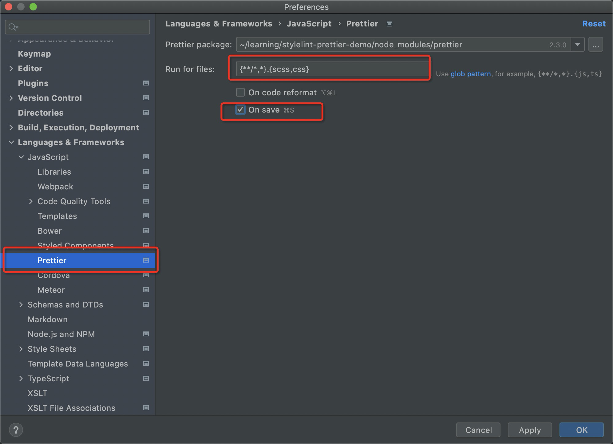

# stylelint-prettier-demo
让项目当中的样式文件保持一致的样式规范的配置

## 配置具有的功能
- 编写样式时对格式错误的地方会标红报错
- 保存文件时自动格式化

## ide集成
`webstorm`
1. prettier（默认时js，因为js通常都用eslint，所以更改一下配置用于css/scss）

2. stylelint (当添加了.stylelintrc之后会默认开启，如果没有开启，可查看该配置并启用)   

   
`其他ide`
- prettier集成可参考 [prettier ide集成](https://prettier.io/docs/en/editors.html)
- stylelint集成可参考 [stylelint ide集成](https://stylelint.io/user-guide/integrations/editor)